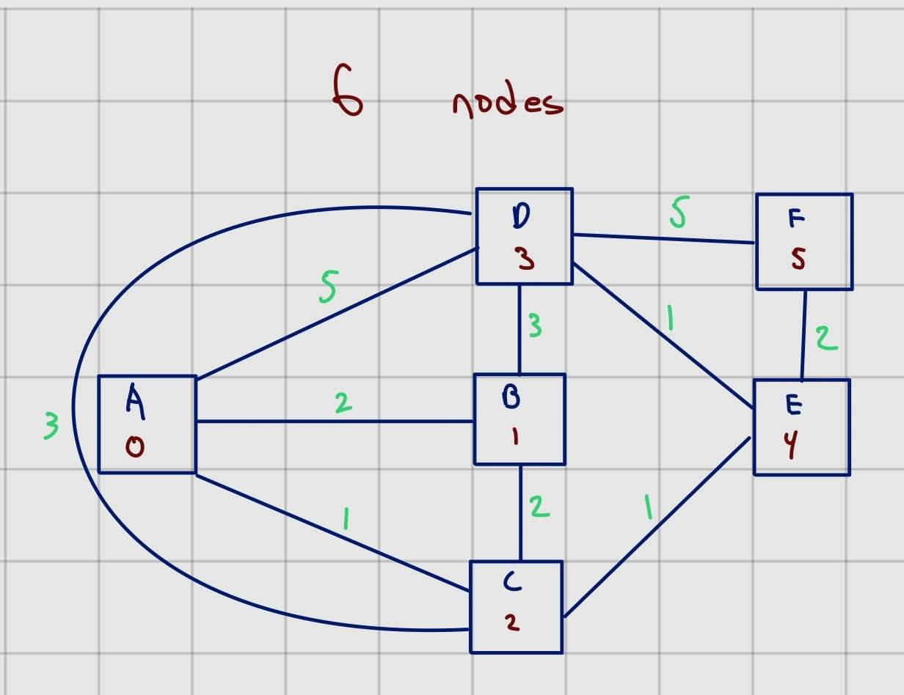

# Router Simulation Project

## Overview
The following project was my final project for my Networking class. It simulates how routers spread data using Dijkstra's algorithm, and demonstates some applications of UDP networking, socket programming, and multithreading in Python.

## Implementation Details
- Uses UDP (User Datagram Protocol) sockets for communication between routers
- Implements threading for concurrent sending, receiving, and processing of router information
- Utilizes Dijkstra's algorithm to calculate shortest paths and update routing tables

### Network Topology


## Requirements
- Python 3.x

## Usage
There are two ways to run the program:

#### 1. Use run_router.bat (Windows only)

Format of command:

```
run_router.bat "C:\path\to\directory\containing\python\file
```

ex:

```
run_router.bat "C:\Programming\router"
```


#### 2. Run each router individually

Format of command:

```
python Router.py <router_number> <port_number> <config_file>
```

ex:

```
python Router.py 0 7000 config-A.txt
```


To simulate router behavior using the given files, open 6 command prompts and change the current working directory to the directory containing Router.py and the config files.

Run on of the routers in each command prompt.
```
python Router.py 0 7000 config-A.txt
```
```
python Router.py 1 7001 config-B.txt
```
```
python Router.py 2 7002 config-C.txt
```
```
python Router.py 3 7003 config-D.txt
```
```
python Router.py 4 7004 config-E.txt
```
```
python Router.py 5 7005 config-F.txt
```

#### Configuration Files
Each config file MUST be formatted with the router label in the first line (Uppercase letter, with the first router starting with A), followed by the router's neighbor label, neighbor ID, distance, and neighbor port.

ex:
```
6
B 1 2 7001
C 2 1 7002 
D 3 5 7003
```

# Author
Damon Mazurek